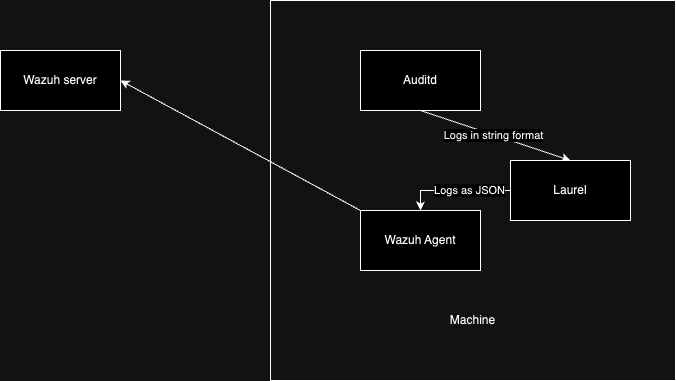

## Description

LAUREL is an event post-processing plugin for auditd(8) that generates useful, enriched JSON-based audit logs suitable for modern security monitoring setups.

## Basic Flow



## Steps Overview

- On the VM/physical Machine:
  - Installing Laurel
  - Configure Laurel
  - Modify wazuh config to monitor Laurel logs instead of Auditd logs

- On the Wazuh Server:

  - Implement Rules and decoder for Laurel in wazuh

## Steps in Detail

### 1. Installation

Download the latest version of laurel from [Releases · threathunters-io/laurel](https://github.com/threathunters-io/laurel/releases/latest), there are multiple versions in accordance to the architecture of the vm/machine.

After which extract and install using the following commands:

```shell
tar xzf laurel-$FLAVOR.tar.gz laurel
sudo install -m755 laurel /usr/local/sbin/laurel
```

### 2. Setup and configure Laurel

So, following the official documentation our following steps should be:

- Create a dedicated user

  ```shell
  sudo useradd --system --home-dir /var/log/laurel --create-home _laurel
  ```

- Add /etc/laurel/config.toml, the file that controls laurel
  - Add the following config for optimal working:

  ```toml
  directory = "/var/log/laurel"
  user = "_laurel"
  statusreport-period = 0
  input = "stdin"

  [auditlog]
  file = "audit.log"
  # Rotate when log file reaches this size (in bytes)
  size = 5000000
  # When rotating, keep this number of generations around
  generations = 10


  # [filterlog]
  # # If filter.filter-action is set to "log", filtered events are
  # # written to this log. It is configured just like [auditlog].
  # file = "filtered.log"
  # size = 1000000
  # generations = 3
  # read-users = [ "splunk" ]

  [transform]

  # to convert the arguments from a string to array

  execve-argv = [ "array" ]

  # execve-argv-limit-bytes = 10000

  [translate]
  # this section is to 
  # arch, syscall, sockaddr structures
  universal = true
  # UID, GID values
  user-db = true
  # Drop raw (numeric) syscall, arch, UID, GID values if they are translated
  drop-raw = true

  [enrich]

  # Add context (event-id, comm, exe, ppid) for *pid entries
  pid = true

  # List of environment variables to log for every EXECVE event
  execve-env = [ "LD_PRELOAD", "LD_LIBRARY_PATH" ]

  # Add container context to SYSCALL-based events
  container = true

  # Add script context to SYSCALL execve events
  script = true

  # Add groups that the user (uid) is a member of. Default: true
  user-groups = true

  [label-process]

  # Audit records that contain certain keys can be reused as a label
  # attached to the process.
  #
  # This is useful in combination with audit rules such as:
  # -w <path> -p x -k <key>
  # e.g.: -w /usr/bin/dpkg -p x -k software_mgmt
  label-keys = [ "software_mgmt" ]

  # Labels can be attached to or removed from processes that run certain
  # programs. The file program file path (SYSCALL.exe or /proc/pid/exe)
  # is matched against regular expressions. This is useful for programs
  # that cannot be identified through auditd file watches (-w <path> -p
  # x -k <key>).
  label-exe.'^/opt/.*/bin/java$' = 'java'
  label-exe.'^/usr/lib/jvm/.*/bin/java$' = 'java'
  label-exe.'^/snap/amazon-ssm-agent/\d+/' = 'amazon-ssm-agent'

  unlabel-exe."bin/php$" = "java"

  # Labels can be attached to or removed from processes that have been identified as
  # scripts.
  label-script."^/root/maint-.*[.]sh$" = "maint"

  # unlabel-script."…" = "maint"

  # Process Labels can be propagated to spawned child processes. This is
  # useful for marking an entire subtree of children that have been
  # spawned within certain contexts (e.g. system management tools,
  # container runtimes, ssh servers, cron, etc.).
  propagate-labels = [ "software_mgmt", "amazon-ssm-agent" ]

  [filter]

  # When audit records with attached keys are being generated,
  # LAUREL will discard these.

  # filter-keys = ["filter-this"]

  # In addition to key based filtering it is also possible to configure label based 
  # filtering. This alows the possibility to filter based on parent processes.

  # filter-labels = ["software_mgmt"]

  # Filter events without specified key

  filter-null-keys = false

  # Filter events that were constructed from input lines matching these
  # regular expressions
  # filter-raw-lines = [
  #     "^type=PATH msg=\\S*? item=\\S*? name=\"/var/run/nscd[.]sock\" "
  # ]

  # Keep the first event observed for any given process even if it would
  # be filtered otherwise. This should only be turned off if
  # reproducible process tracking or process tree reconstruction is not
  # required.
  # keep-first-per-processes = true

  # What to do with filtered events? "drop" or "log" to the filterlog
  # defined above.
  filter-action = "drop"
  ```

- Register LAUREL as an auditd plugin by adding the following:

  ```conf
    active = yes
    direction = out
    type = always
    format = string
    path = /usr/local/sbin/laurel
    args = --config /etc/laurel/config.toml
  ```

- Restart AuditD by the following:

  ```shell
  sudo pkill -HUP auditd
  ```

### 3. Configure wazuh agent to retrieve laurel logs instead of auditd logs

- We need to add the following lines to wazuh agent's ossec.conf (which is located in /var/ossec/etc/ossec.conf and will require sudo), will expain what it does in a min

  ```xml
  <ossec_config>
    <localfile>
      <log_format>json</log_format>
      <location>/var/log/laurel/auth.json</location><!-- the location specified in /etc/laurel/config.toml as directory-->
    </localfile>
  </ossec_config>
  ```

- The addition is simple
  - ```<log_format>``` specifies the format of the logs present in laruel's logfile,
  - ```<location>``` specifies the location of the logfile to be read

- Restart wazuh agent by running

  ```shell
  sudo systemctl restart wazuh-agent
  ``` 

- Work done on agent side, on to the server.

### 4. Configure decoders and rules for Laurel/auditd logs

- Since Laurel Logs are proper JSON Logs, no need to write a decoder, just start with a base rule and build on top of it.
- The following is the base rule i wrote, it can be changed according to necessity
  ```xml
  <group name="local,auditd,">

    <rule id="100002" level="2">
         <decoded_as>json</decoded_as>
         <field name="SYSCALL.SYSCALL">execve</field>
        <description>Auditd syscall base_rule</description>
        <group>audit_command,syscall,laurel,</group>
    </rule>
  ...
  </group>
  ```
- You can build on top of this rule as per requirement, enjoy.

The End