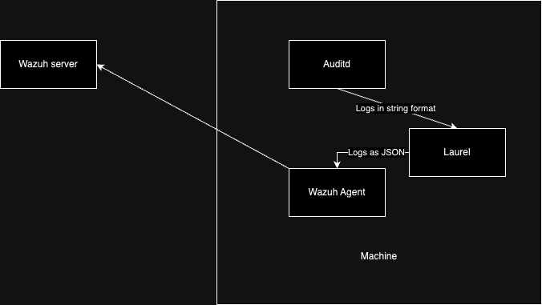

## Description
LAUREL is an event post-processing plugin for auditd(8) that generates useful, enriched JSON-based audit logs suitable for modern security monitoring setups.

## Basic Flow


## Steps Overview:
- On the VM/physical Machine:
  - Installing Laurel
  - Configure Laurel
  - Modify wazuh config to monitor Laurel logs instead of Auditd logs

- On the Wazuh Server:

  - Implement Rules and decoder for Laurel in wazuh

## Steps in Detail:
### 1. Installation
Download the latest version of laurel from Releases · threathunters-io/laurel, there are multiple versions in accordance to the architecture of the vm/machine.

After which extract and install using the following commands:

```shell
tar xzf laurel-$FLAVOR.tar.gz laurel
sudo install -m755 laurel /usr/local/sbin/laurel
```
### 2. Setup and configure Laurel

### 3. Configure wazuh agent to retrieve laurel logs instead of auditd logs

### 4. Configure decoders and rules for auditd logs.